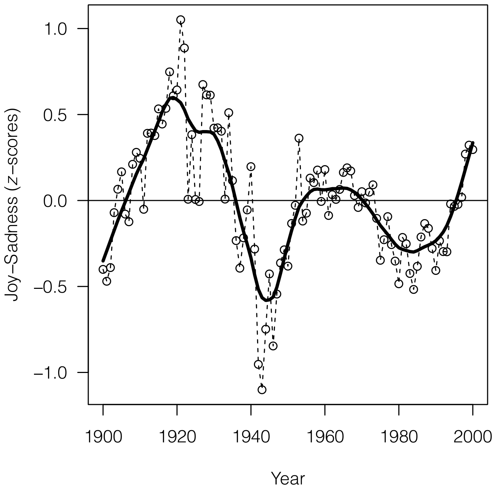

In a 2013 paper by Acerbi et al., a group of researchers was able to track the "mood" throughout the 20th century by analysing words in books using Google's Ngram database. The resulting plot looks like this:

There are several things to note from the above figure:

1- The peek of happiness was reached around 1920, afterwards a downward emotions took a downward trajectory that reached its nadir around 1944-45. There are several explanations for this downward trend; in her book 'Pale Rider', author Laura Spinney describes an onset of melancholy that became evident in the wake of the Spanish flu pandemic of 1918-1920, which was reflected in some of the major works of fiction during the 1920s (The Strain 1919, Ulysses 1922, Mrs Dalloway 1925). She says: "Intriguingly, post-viral fatigue leaves more of a trace than the flue itself, as if writers had mistaken the disease for the metaphor, and been tricked into giving it a proper treatement." Other major events that took place during the 1920-45 time span, and that could have contributed to the morose temperament seen here are the great depression (1930s) and the Second World War (1939-1945).

2- There is another dip towards sadness around the 1970s and 80s, coincinding with the cold war, the AIDs outbreak, and the fear of nuclear holocaust.

3- Finally, the century ends on an upward trajectory that started around 1990, reflecting the general state during that time
